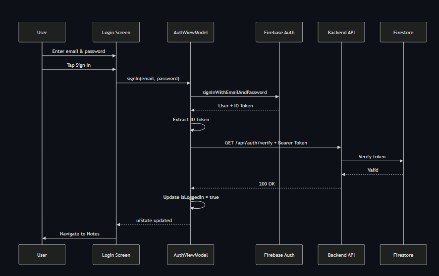
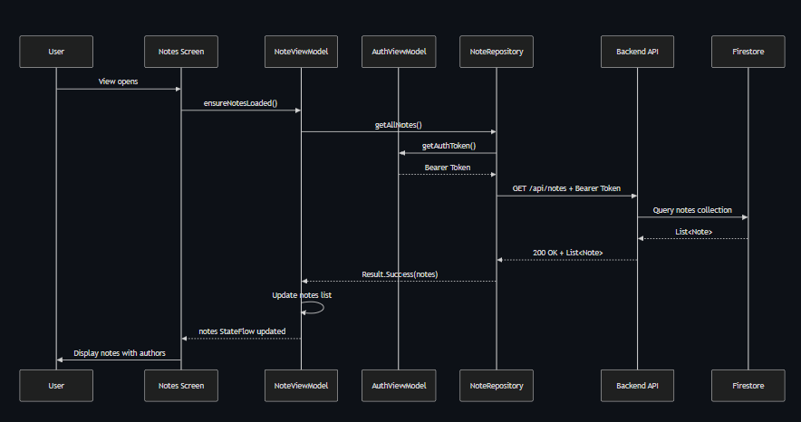

# 📝 NoteApp - Full Stack Note-Taking Application

A modern full-stack note-taking application with **Firebase Authentication**, **Firestore Database**, and real-time synchronization across devices.

## 🏗️ Architecture

```
┌──────────────────────────────────────────────────────────┐
│                         NoteApp                          │
├──────────────────────────────────────────────────────────┤
│  📱 Frontend (Android)          🖥️ Backend (Spring Boot)│
│  • Jetpack Compose              • REST API               │
│  • Kotlin                       • Kotlin                 │
│  • MVVM Architecture            • Firebase Admin SDK     │
│                                 • Spring Secuity         │
└──────────────────────────────────────────────────────────┘
```

## 🔑 Key Features

### 🔐 Firebase Authentication
- **Email/Password Registration** - Create new accounts with validation
- **Secure Login** - Firebase handles password hashing and storage
- **ID Token Management** - Automatic token refresh for API requests
- **Session Management** - Persistent login across app restarts

```kotlin
// Frontend: User logs in
authViewModel.signIn(email, password)
// → Firebase generates ID token
// → Token included in API requests: Authorization: Bearer {token}
```

### 📚 Firestore Database
- **User Documents** - Store user profiles and metadata
- **Note Collections** - Per-user note storage in Firestore
- **Real-time Sync** - Data persists across devices
- **Security Rules** - Users can only access their own data

```
Firestore Structure:
├── users/
│   └── {userId}/
│       ├── name: string
│       ├── email: string
│       └── notes/ (subcollection)
│           └── {noteId}
│               ├── title: string
│               ├── content: string
│               └── createdAt: timestamp
```

## 📱 Frontend (Android)

### Stack
- **Language**: Kotlin 2.0+
- **UI Framework**: Jetpack Compose
- **Architecture**: MVVM
- **Networking**: Retrofit 2
- **Min SDK**: 24 | **Target SDK**: 34

### Project Structure
```
frontend/app/src/main/java/com/example/noteapp/
├── ui/
│   ├── screens/          # Compose UI screens
│   ├── components/       # Reusable UI components
│   ├── navigation/       # Navigation graph & routing
│   └── theme/            # Material Design theme
├── viewmodel/            # State management (MVVM)
├── data/
│   ├── remote/           # Retrofit API service
│   ├── repository/       # Data access abstraction
│   └── model/            # Data classes
└── MainActivity.kt       # App entry point
```

### Authentication Flow
```
1️⃣  User enters credentials on LoginScreen
2️⃣  AuthViewModel.signIn() calls Firebase Auth
3️⃣  Firebase returns ID token
4️⃣  Token stored in memory (auth.currentUser)
5️⃣  App navigates to NotesScreen when token ready
6️⃣  Token automatically refreshed on each API call
```

## 🖥️ Backend (Spring Boot)

### Stack
- **Language**: Kotlin 2.0+
- **Framework**: Spring Boot 3.5.6
- **Security**: Spring Security + Firebase Token Filter
- **Database**: Firestore (Firebase Admin SDK)
- **Port**: 8080

### Project Structure
```
backend/NoteAppAPI/src/main/kotlin/org/example/noteappapi/
├── controller/           # REST endpoints
├── security/             # Firebase token validation
├── config/               # CORS & Spring config
├── model/                # Data classes
├── routes/               # Route definitions
└── NoteAppApiApplication.kt
```

### API Endpoints

| Method | Endpoint | Purpose |
|--------|----------|---------|
| `POST` | `/api/auth/verify` | Verify Firebase token validity |
| `GET` | `/api/notes` | Get all user's notes |
| `POST` | `/api/notes` | Create new note |
| `DELETE` | `/api/notes/{id}` | Delete note |
| `POST` | `/api/auth/register` | Register user in Firestore |

### Security
```
Request Flow:
1. Client sends: Authorization: Bearer {token}
2. FirebaseTokenFilter intercepts request
3. Verifies token with Firebase Admin SDK
4. Extracts userId from verified token
5. Stores in SecurityContext for endpoint use
6. Endpoint accesses user's Firestore data
```

## 🔄 Data Flow

### Sequence Diagrams

#### 1️⃣ Login Flow


User enters credentials → Firebase Auth generates token → Backend verifies token → Navigate to Notes screen

#### 2️⃣ Registration Flow


User provides name, email, password → Firebase creates account → Backend creates user document → Firestore stores user profile

#### 3️⃣ Fetching Notes


User views Notes screen → Frontend requests notes with Bearer token → Backend queries Firestore → Returns user's notes list

### Creating a Note
```
📱 Frontend                          🖥️ Backend              📊 Firestore
   ↓                                    ↓                         ↓
User clicks "Legg til"
   ↓
AddNoteScreen
   ↓
NoteViewModel.addNote()
   ↓
Repository.createNote()
   ↓
ApiService.createNote()
   │
   └──→ POST /api/notes
        + Authorization: Bearer {token}
        + {title, content}
                                       ↓
                                   FirebaseTokenFilter
                                   (verify token)
                                       ↓
                                   NoteController
                                       ↓
                                   Save to Firestore
                                       ↓
                                   users/{userId}/notes/{id}
        ←──────────────────────────────↓
   Returns created note
        ↓
   UI updates with new note
```

## 🚀 Getting Started

### Prerequisites
- Android Studio (Dolphin or newer)
- Java 17+
- Firebase project with:
  - Authentication enabled
  - Firestore database created
  - `google-services.json` configured

### Frontend Setup
```bash
cd frontend
./gradlew :app:installDebug
```

### Backend Setup
```bash
cd backend/NoteAppAPI
# Add Firebase credentials to application.properties
./gradlew bootRun
```

## 🔐 Firebase Setup

1. **Create Firebase Project** at console.firebase.google.com
2. **Enable Authentication**
   - Email/Password provider
   - Download `google-services.json` → `frontend/app/`

3. **Create Firestore Database**
   - Start in production mode
   - Create security rules (see FIRESTORE_SETUP.md)

4. **Backend Credentials**
   - Generate service account key
   - Place in `backend/` directory

## 📊 State Management

### Frontend (MVVM)
```
┌──────────────────────────────────────┐
│           Composable UI              │ ← observes state
│         (NotesListScreen)            │
└──────────────────────────────────────┘
           ↑        ↓
        StateFlow  User Input
           ↑        ↓
┌──────────────────────────────────────┐
│         ViewModel                    │ ← holds state
│      (NoteViewModel)                 │ ← handles logic
└──────────────────────────────────────┘
           ↑        ↓
        Data Flow  API Calls
           ↑        ↓
┌──────────────────────────────────────┐
│         Repository                   │ ← abstracts data
│      (NoteRepository)                │
└──────────────────────────────────────┘
           ↑        ↓
        HTTP API  Retrofit
           ↑        ↓
         Backend  Firestore
```

## 🛡️ Authentication Lifecycle

```
App Start
  ↓
Firebase.auth.currentUser check
  ↓
User logged in?
  ├─ YES → Load token, navigate to Notes
  └─ NO  → Show LoginScreen
            ↓
          User enters credentials
            ↓
          signIn(email, password)
            ↓
          Firebase Auth returns user
            ↓
          isLoading = false, isLoggedIn = true
            ↓
          LaunchedEffect detects state change
            ↓
          Navigate to NotesScreen
            ↓
          Token ready for API calls
```

## 📦 Dependencies

### Frontend
```gradle
// Firebase
implementation platform("com.google.firebase:firebase-bom:32.x.x")
implementation "com.google.firebase:firebase-auth-ktx"

// Networking
implementation "com.squareup.retrofit2:retrofit:2.9.0"

// UI
implementation "androidx.compose.ui:ui:1.5.0"
```

### Backend
```gradle
// Spring Boot
implementation "org.springframework.boot:spring-boot-starter-web:3.5.6"
implementation "org.springframework.boot:spring-boot-starter-security"

// Firebase
implementation "com.google.firebase:firebase-admin:9.0.0"
```

## 🧪 Testing

### Frontend
```bash
# Unit tests
./gradlew :app:testDebug

# Instrumented tests (on device)
./gradlew :app:connectedAndroidTest
```

### Backend
```bash
./gradlew test
```

---

**Status**: ✅ Fully functional with Firebase Auth & Firestore integration
